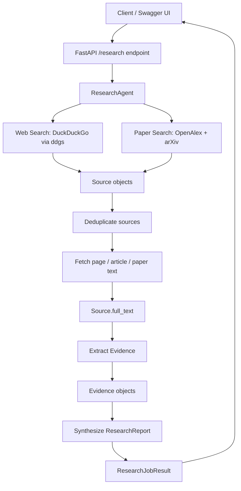
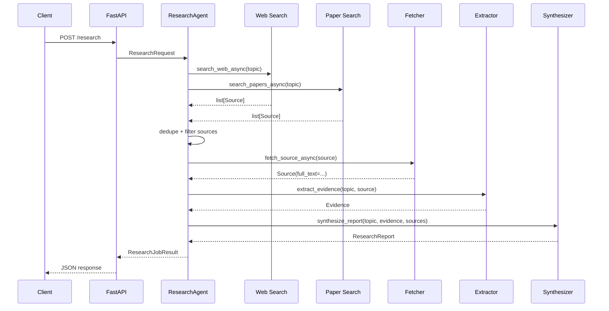
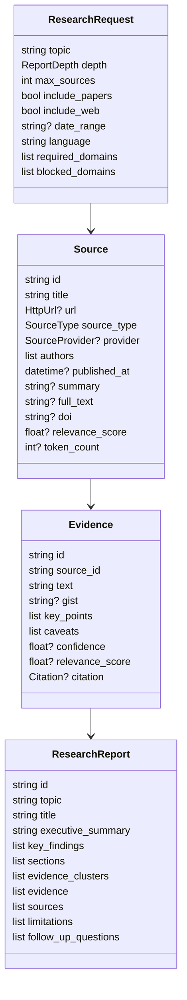
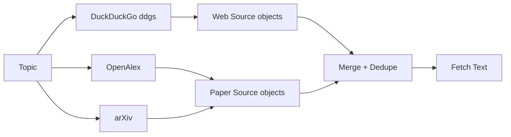
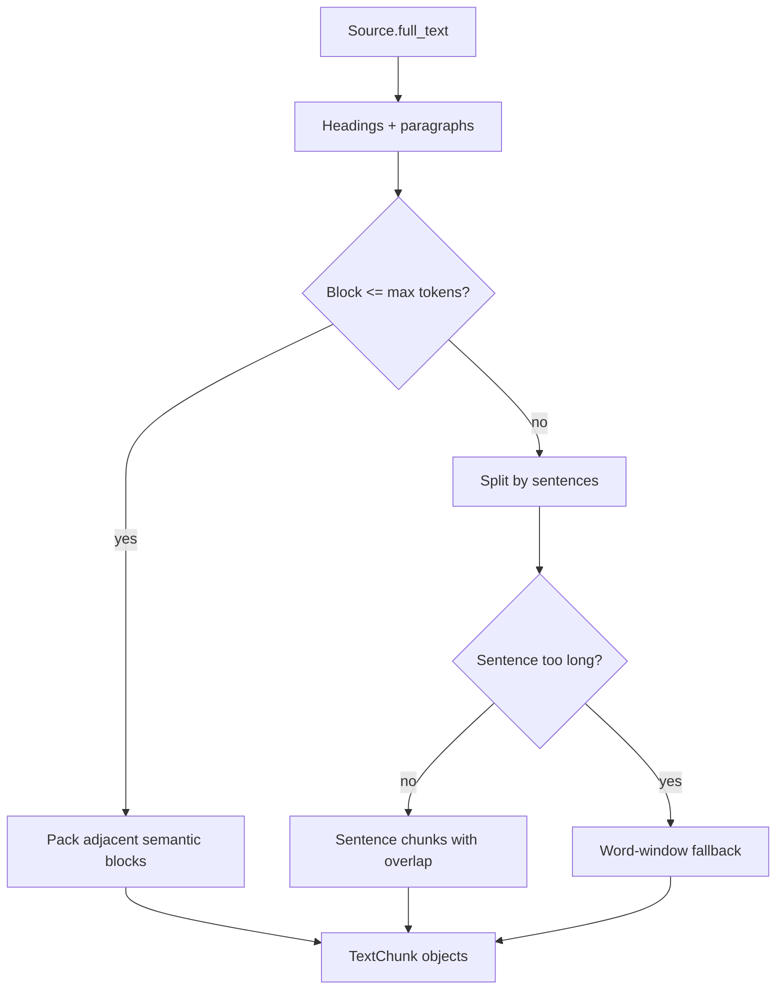
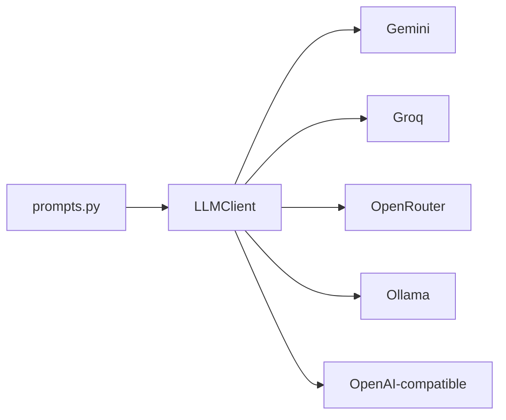

# Research Agent API

FastAPI service for topic-driven research. Given a research topic, the service searches web and academic sources, fetches readable text, extracts evidence, and synthesizes a structured report with citations.

The implementation is intentionally modular: retrieval, fetching, extraction, processing, LLM prompting, and synthesis are separate services under `app/services`.

## Abstract

Research Agent API is a backend system for automating the first pass of evidence-driven research. The service accepts a user-supplied topic, discovers relevant web pages and academic papers, fetches source text, normalizes the material into internal `Source` objects, extracts topic-specific `Evidence`, and composes a final `ResearchReport`.

The project is designed as a practical research pipeline rather than a chatbot. Each stage produces typed intermediate artifacts that can be inspected, ranked, deduplicated, tested, or replaced independently. Retrieval currently uses DuckDuckGo for general web search and OpenAlex plus arXiv for academic search, avoiding required paid search APIs. The extraction and synthesis stages have deterministic implementations so the pipeline can run without an LLM, while the LLM layer is available for future improvements such as structured extraction, query expansion, and higher-quality report drafting.

The main goal is to turn an open-ended research topic into a structured, auditable report that includes source metadata, evidence summaries, key findings, caveats, and follow-up questions.

## System Overview



## Runtime Pipeline



## Package Layout

```text
app/
  main.py                         FastAPI application entrypoint
  api/
    routes.py                     /research and health endpoints
    deps.py                       Reserved for shared FastAPI dependencies
  schemas/
    research.py                   Request/job schemas
    source.py                     Source/search-result schemas
    evidence.py                   Evidence/citation schemas
    report.py                     Final report schemas
  services/
    agent.py                      Pipeline orchestrator
    retrieval/
      web_search.py               DuckDuckGo/Brave web search normalization
      paper_search.py             OpenAlex/arXiv/Semantic Scholar normalization
      fetch.py                    Fetch and clean source text
    processing/
      dedupe.py                   DOI/URL/title/text deduplication
      ranking.py                  TF-IDF cosine ranking helpers
      chunking.py                 Retrieval-oriented semantic chunking
    extraction/
      extractor.py                Source.full_text -> Evidence
    synthesis/
      synthesizer.py              Evidence -> ResearchReport
    llm/
      client.py                   Provider-aware LLM HTTP client
      prompts.py                  Prompt builders
      parser.py                   Reserved for output parsing helpers
```

## Data Model



## Setup

The project is intended to run in the `thenv` conda environment.

```bash
conda activate thenv
python -m pip install -r requirements.txt
```

Run the API:

```bash
uvicorn app.main:app --reload
```

Or without activating the environment:

```bash
conda run -n thenv uvicorn app.main:app --reload
```

Open the interactive docs:

```text
http://127.0.0.1:8000/docs
```

Health check:

```bash
curl http://127.0.0.1:8000/health
```

Expected response:

```json
{"status":"ok"}
```

## Environment Variables

Minimum no-key retrieval configuration:

```env
WEB_SEARCH_PROVIDER=duckduckgo
PAPER_SEARCH_PROVIDERS=openalex,arxiv
OPENALEX_EMAIL=you@example.com
```

LLM configuration is optional for the current deterministic pipeline, but `app/services/llm/client.py` supports several providers.

Gemini:

```env
LLM_PROVIDER=gemini
GEMINI_API_KEY=your_key
GEMINI_MODEL=gemini-2.0-flash
```

Groq:

```env
LLM_PROVIDER=groq
GROQ_API_KEY=your_key
GROQ_MODEL=llama-3.1-8b-instant
```

OpenRouter:

```env
LLM_PROVIDER=openrouter
OPENROUTER_API_KEY=your_key
OPENROUTER_MODEL=meta-llama/llama-3.1-8b-instruct:free
```

Local Ollama:

```env
LLM_PROVIDER=ollama
OLLAMA_MODEL=qwen2.5:7b
OLLAMA_BASE_URL=http://localhost:11434
```

Brave and Semantic Scholar are still supported by code but are not required by default:

```env
WEB_SEARCH_PROVIDER=brave
BRAVE_SEARCH_API_KEY=your_key
SEMANTIC_SCHOLAR_API_KEY=your_key
```

Do not commit `.env`.

## API

### POST `/research`

Runs the complete research pipeline.

Request:

```json
{
  "topic": "green hydrogen production costs and limitations",
  "depth": "quick",
  "max_sources": 3,
  "include_papers": true,
  "include_web": true,
  "date_range": null,
  "language": "en",
  "required_domains": [],
  "blocked_domains": []
}
```

Response shape:

```json
{
  "job": {
    "id": "J-...",
    "status": "completed",
    "request": {},
    "created_at": "2026-04-16T...",
    "updated_at": "2026-04-16T...",
    "completed_at": "2026-04-16T...",
    "progress": 1,
    "current_step": "Completed",
    "error": null
  },
  "report": {
    "id": "R-...",
    "topic": "...",
    "title": "...",
    "executive_summary": "...",
    "key_findings": [],
    "sections": [],
    "evidence_clusters": [],
    "evidence": [],
    "sources": [],
    "limitations": [],
    "follow_up_questions": []
  }
}
```

Example:

```bash
curl -X POST http://127.0.0.1:8000/research \
  -H "Content-Type: application/json" \
  -d '{
    "topic": "green hydrogen production costs and limitations",
    "depth": "quick",
    "max_sources": 3,
    "include_papers": true,
    "include_web": true,
    "date_range": null,
    "language": "en",
    "required_domains": [],
    "blocked_domains": []
  }'
```

### GET `/health`

Global API health check.

```bash
curl http://127.0.0.1:8000/health
```

### GET `/research/health`

Research router health check.

```bash
curl http://127.0.0.1:8000/research/health
```

## Retrieval Providers



Web search:

- Default: DuckDuckGo through `ddgs`
- Optional: Brave Search API

Paper search:

- Default: OpenAlex and arXiv
- Optional: Semantic Scholar

OpenAlex and arXiv require no API keys. `OPENALEX_EMAIL` is recommended so OpenAlex can identify polite API traffic.

## Processing Strategy

### Deduplication

`app/services/processing/dedupe.py` removes obvious duplicates using:

- DOI normalization
- arXiv ID normalization
- canonical URL normalization
- tracking parameter removal
- title similarity
- text fingerprints when available

### Ranking

`app/services/processing/ranking.py` provides dependency-free lexical ranking:

- tokenization
- stopword removal
- TF-IDF vectors
- cosine similarity
- small source/evidence quality boosts

### Chunking

`app/services/processing/chunking.py` chunks for retrieval usefulness:

- preserve section headings
- preserve paragraphs when possible
- split oversized sections by sentence
- add semantic overlap
- fall back to word windows only for oversized single sentences



## LLM Layer

The current pipeline can run without an LLM because extraction and synthesis have deterministic implementations. The LLM layer is available for later upgrades:

- query expansion
- structured evidence extraction
- report drafting
- citation checking

`app/services/llm/client.py` is provider-aware and uses plain HTTP. No provider SDK is required.



## Failure Behavior

The agent is designed to tolerate partial provider failures:

- if one search provider fails, remaining providers can still produce sources
- sources that fail fetching are skipped
- sources without extractable text are skipped
- the job fails only if no sources, no fetched text, or no evidence is available

API failures return HTTP `502` with the job error in `detail`.

## Development Checks

Compile all modules:

```bash
conda run -n thenv python -m compileall app
```

Verify route registration:

```bash
conda run -n thenv python -c "from app.main import app; print([r.path for r in app.routes])"
```

Expected core routes:

```text
/health
/research
/research/health
/docs
/openapi.json
```

## Current Limitations

- The `/research` endpoint is synchronous from the API client perspective. Long research jobs keep the HTTP request open until completion.
- The deterministic extractor is heuristic and should be replaced or augmented with LLM-based structured extraction for higher quality.
- DuckDuckGo via `ddgs` is useful for local development but is not a formal production search API.
- PDF extraction uses `pypdf`; scanned PDFs require OCR and are not handled.
- No persistence layer is currently active; job state is returned directly and not stored.

## Recommended Next Changes

1. Add background job execution with persisted `ResearchJob` state.
2. Add LLM-backed extraction using `evidence_extraction_*_prompt`.
3. Add LLM-backed report synthesis using `report_synthesis_*_prompt`.
4. Add tests for retrieval normalizers, dedupe, ranking, chunking, and API validation.
5. Add `.env.example` with non-secret configuration keys.
